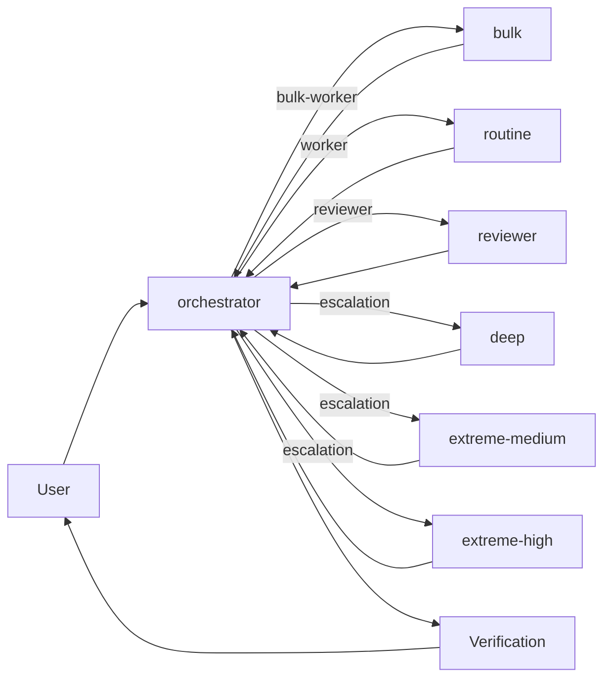
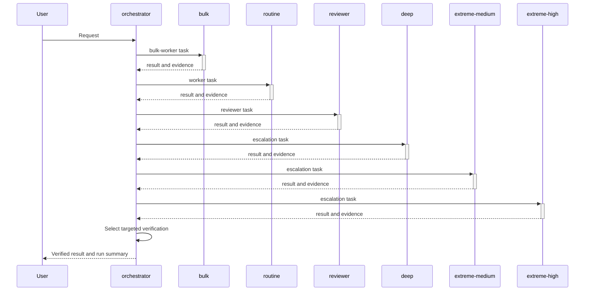

<!-- Generated by scripts/generate-docs.ts. Do not edit directly. -->
# OpenAI + Command Code Router

Uses a subscription-backed orchestrator and low-cost workers, escalating difficult work back to the baseline model.

## Simple View

The baseline is `orchestrator` using `openai/gpt-5.6-sol`. Workers return their result to the orchestrator; the orchestrator remains responsible for verification and the final response.

## Detailed View

### Agents

| Agent | Role | Model | Effort | Steps | Billing source | Approval required |
|---|---|---|---|---:|---|---|
| `orchestrator` | orchestrator | `openai/gpt-5.6-sol` | low | 30 | chatgpt-subscription | No |
| `bulk` | bulk-worker | `commandcode/mimo-v2.5` | default | 12 | commandcode-credits | No |
| `routine` | worker | `commandcode/deepseek-v4-pro` | high | 24 | commandcode-credits | No |
| `reviewer` | reviewer | `commandcode/mimo-v2.5-pro` | default | 12 | commandcode-credits | No |
| `deep` | escalation | `openai/gpt-5.6-terra` | high | 24 | chatgpt-subscription | Yes |
| `extreme-medium` | escalation | `openai/gpt-5.6-sol` | medium | 30 | chatgpt-subscription | Yes |
| `extreme-high` | escalation | `openai/gpt-5.6-sol` | high | 30 | chatgpt-subscription | Yes |

### Routing

- Send repetitive, low-risk, token-heavy transformations to bulk.
- Send bounded routine implementation, exploration, and fast-path work with clear acceptance criteria to routine.
- Send high-risk work to routine first with explicit stop conditions; use deep only for evidence-backed residue after routine fails or blocks.
- Use reviewer selectively for missing or failed verification, high-risk changes, and configured samples.
- When a workflow explicitly requests code review, prefer reviewer and keep the reviewer in a different model family from the implementation worker where possible.
- Route images, screenshots, PDFs, diagrams, and large-context reads to antigravity_vision or antigravity_delegate via Gemini 3.6 Flash when Antigravity is available.
- After collecting Playwright/browser artifacts, split visual outputs (screenshots, rendered PDFs) to antigravity_vision and textual artifacts (accessibility snapshots, console excerpts, network summaries, text trace excerpts) to antigravity_delegate for analysis rather than reciting them with expensive primary-model tokens. Extract bounded screenshots or text from binary Playwright traces before routing.

### Escalation

- Do not escalate merely because a task is long or spans multiple files.
- Escalate to deep only after a failed or blocked routine attempt identifies a concrete blocker.
- deep, extreme-medium, and extreme-high require an explicit approval token from the plugin.
- A worker may retry bounded verification failures before escalating.

### Verification

- Repository discovery: enabled
- Maximum worker attempts: 2
- Full-suite threshold: high risk
- The plugin records observed checks; passing checks are evidence, not proof of correctness.

### Orchestration

- Maximum delegated tasks per run: 12
- Maximum concurrent workers: 3
- Independent work may run as a parallel frontier; dependent or overlapping work remains serial.

### Reviewer

The `reviewer` agent is enabled by default. Triggers: explicit, milestone, high-risk, sampled. Sample rate: 10%. Maximum rounds: 2. Maximum findings per round: 5. Maximum packet size: 12000 characters.

### Telemetry

Every root user turn becomes a run. Reports include actual model/provider usage, billing source, subagent count, tasks, verification evidence, evaluator cost, explicit feedback, and quota snapshots. Task-to-child linkage is marked as correlated unless OpenCode exposes an explicit identifier.

### Limitations

- ChatGPT subscription capacity is not token-metered, so capacity savings remain estimated.
- Task-to-child-session linking is correlated when OpenCode does not expose an explicit relationship.
- Model review is evidence, not ground truth.
- Cross-family review selection is prompt-enforced; user agent overrides can make an independent model unavailable.
- Browser/frontend artifact routing through Antigravity is a prompt policy within the orchestrator; it does not provide a Playwright MCP integration or intercept browser tool calls.
